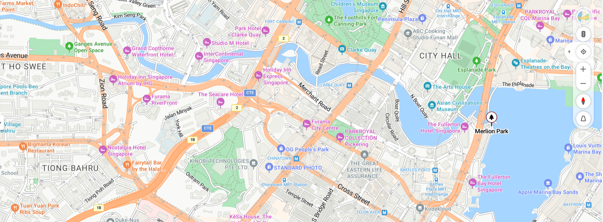
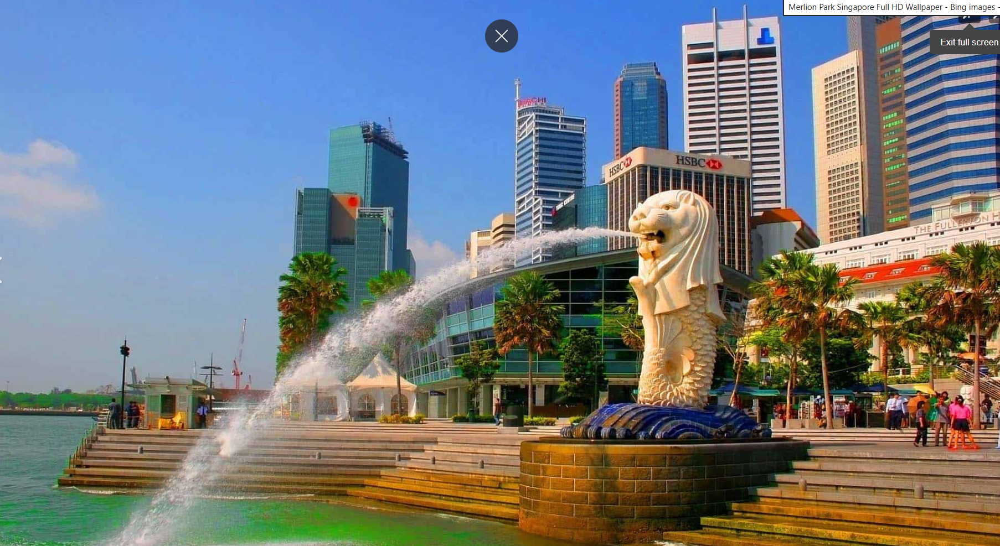
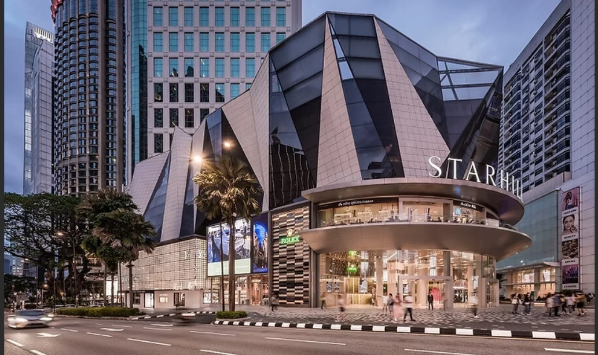
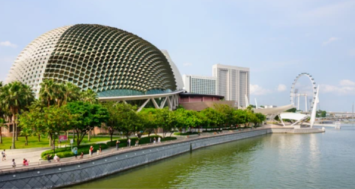

# Ex04 Places Around Me
## Date: 22.09.2025

## AIM
To develop a website to display details about the places around my house.

## DESIGN STEPS

### STEP 1
Create a Django admin interface.

### STEP 2
Download your city map from Google.

### STEP 3
Using ```<map>``` tag name the map.

### STEP 4
Create clickable regions in the image using ```<area>``` tag.

### STEP 5
Write HTML programs for all the regions identified.

### STEP 6
Execute the programs and publish them.

## CODE
```
<!DOCTYPE html>
<html lang="en">
<head>
    <meta charset="UTF-8">
    <meta name="viewport" content="width=device-width, initial-scale=1.0">
    <title>Document</title>
</head>
<body>
    <!-- Image Map Generated by http://www.image-map.net/ -->


<map name="image-map">
    <area target="" alt="MERLIN PARK" title="MERLIN PARK" href="merlionpark.html" coords="1177,287,1742,471" shape="rect">
    <area target="" alt="FURAMA CITY CENTRE" title="FURAMA CITY CENTRE" href="furamacitycentre.html" coords="952,276,177" shape="circle">
    <area target="" alt="ESPLANADE PARK" title="ESPLANADE PARK" href="esplanadepark.html" coords="1431,242,1621,80,1630,249,1282,255,1482,81,1463,170,1307,176,1392,186,1626,75,1429,248,1472,133" shape="poly">
</map>
</body>
</html>
```
## OUTPUT






## RESULT
The program for implementing image maps using HTML is executed successfully.
